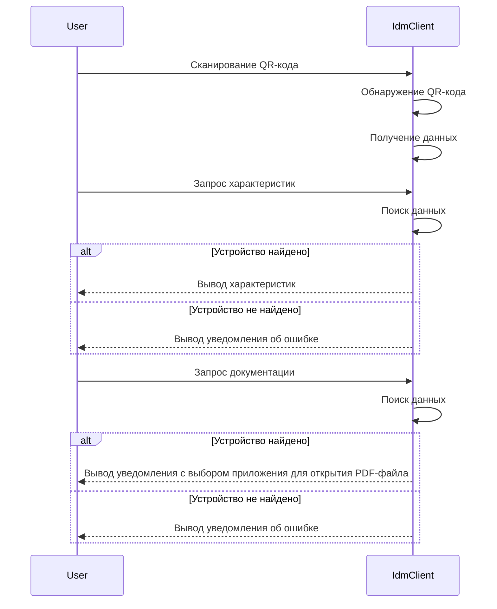
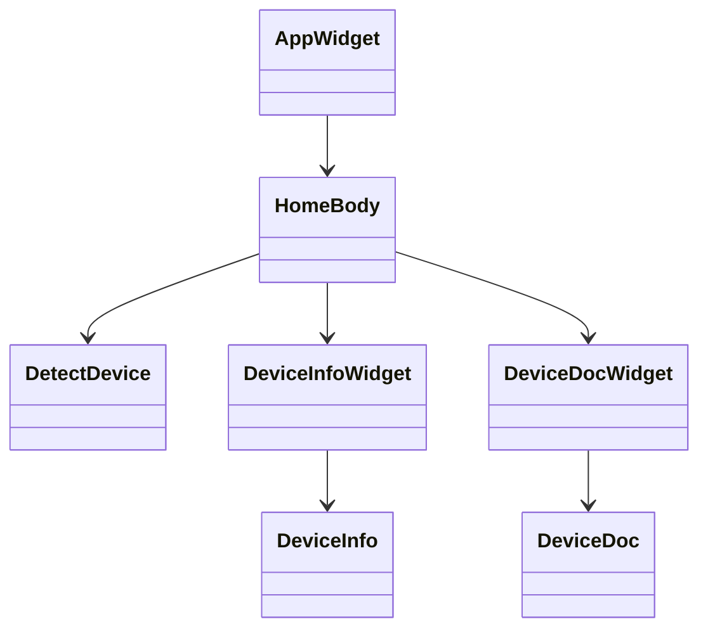

# IDM-Client - Описание функций
## Функции
- домен:
    - **DetectDevice** - обрабатывает кадры с камеры, распознает qr-коды и создает устройства
    - **Failure** - контейнер для представления ошибки
    - **Point** - блок данных, который включает в себя информацию, поступающую из JSON-файла:
        - **PointType** - контейнер для указанных типов `Point`
        - **Status** - контейнер для статусов `Point`
    - **Device** - определяет время жизни устройства и его положение на экране
    - **Pos** - положение X, Y

- информация:
	- **DeviceInfo** - предоставляет основные характеристики устройства
	- **DeviceDoc** - предоставляет документацию устройства
- поток: 
	- **DeviceStream** - прослушивает поток событий с сервера, получает статус для всех устройств, публикует подписку на определенное устройство:
		- **Message** - считывает и извлекает байты сокета в поток
        - **Connect** - создаёт соединение между сокетом и `Message`
		- **ParseSyn** - парсит данные синхронизации из потока данных, полученного из `Message`
		- **ParseUid** - извлекает уникальный идентификатор (UID) устройства
		- **ParseKind** - определяет тип события (kind)
		- **ParseSize** - извлекает размер данных
		- **ParseData** -  парсит фактические данные
- виджеты:
	- **HomeBody** - главный экран, транслирует картинку с камеры
	- **DeviceInfowWidget** - отображает основные характеристики устройства
	- **DeviceButtons** - отображает кнопки взаимодействия
    - **DevicePainter** - отвечает за отрисовку рамки и текстовой таблички

## Функционал

## Поведенческая диаграмма

## Диаграмма классов

