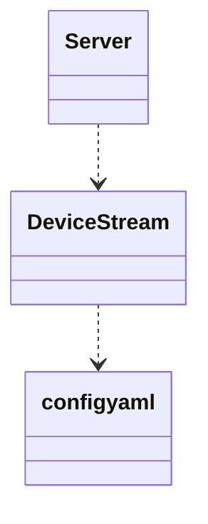

# IDM-Server - Описание функций
## Функции
- конфигурация:
    - **Conf** - конфигурация сервера
- информация:
    - **DeviceInfo** - 
- domain:
    - **Eval** - 
    - **Sync** -
        - **Hub** - 
        - **LinkSend** - 
        - **Link** - 
- сервер:
    - **SelectAct** -
        - **Command** -
        - **DevConf** -
        - **DevStreamConf** -
        - **DevStream** -
    - **SelectReq** -
        - **Context** -
        - **Request** -
        - **SelectDevDoc** -
        - **SelectDevInfo** -
    - **ConnectionConf** -
    - **Connection** -
    - **Cot** -
    - **SelectCot** -
    - **ServerConf** -

    
- **DeviceStream** - produces events by device
- **Server** - opens Socket server, creates DeviceStream's specified in the `config.yaml`
- **ApiServer** - provides Overview info and DocInfo by devices

## Поведенческая диаграмма

## Диаграмма классов

references

- [Requirenments](https://blog.bit.ai/software-requirements-document/)
- https://blog.bit.ai/software-design-document/
- https://www.geeksforgeeks.org/design-documentation-in-software-engineering/

- Принимает входящие подключения на TCP сокете в отдельном потоке

- Обрабатывает входящие подключения в отдельном потоке

- В отделном сервисе принимает API запросы 

- В отделном публикует спонтанные мообщения о текущем состоянии устройств 