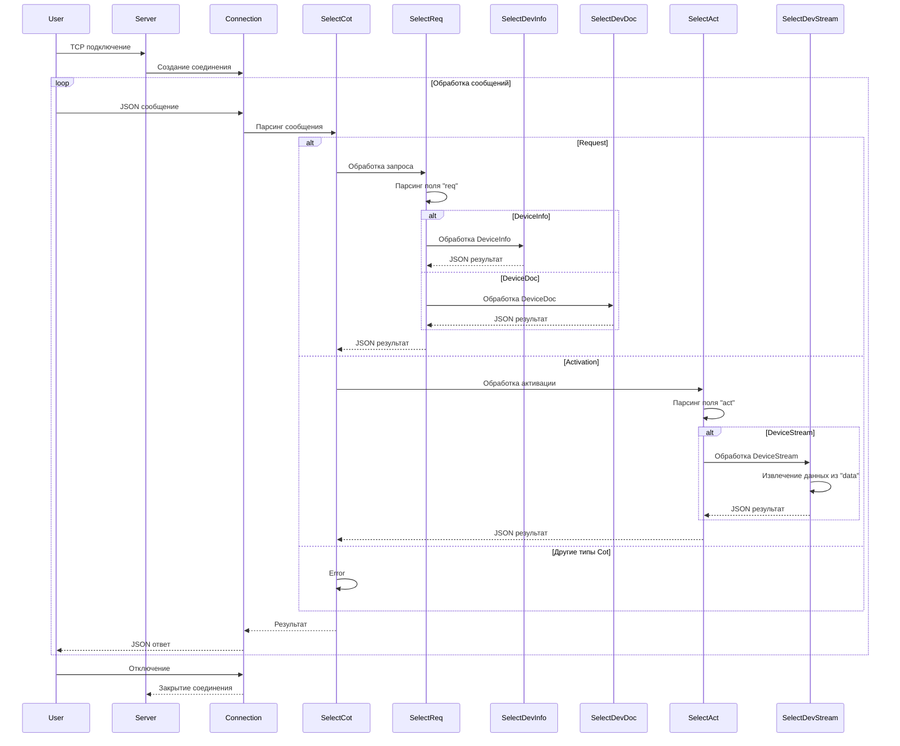
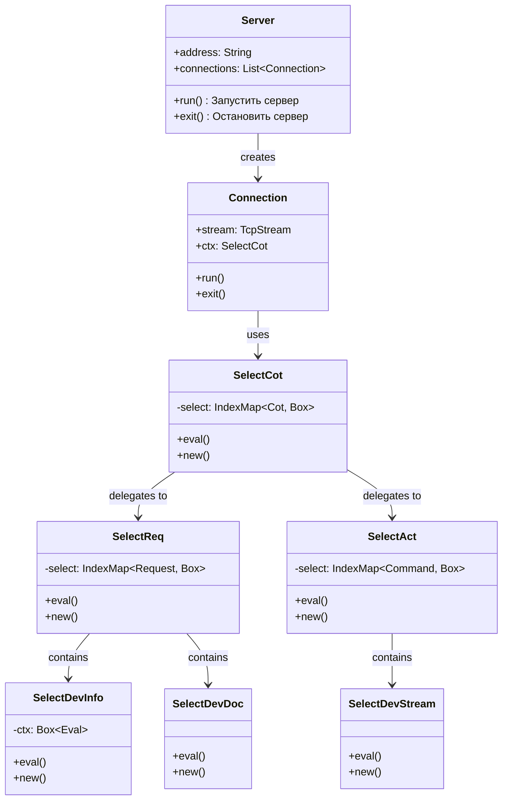

# IDM-Server - Описание функций

## Ключевые компоненты

### TCP-сервер (Server)

**Функционал**
- Открытие сокета на указанном порту из заданной конфигурации
- Прослушивание входящих подключений
- Обработка подключений паралельно в `Connection`
- Обработка команд и запросов от клиента

**Жизненный цикл**
1. Создание объекта сервера
2. Запуск сервера:
    1. Открытие сетевого порта
    2. Ожидание подключнения клиента
    3. Создание `Connection` для подключённого клиента
    4. Передача в `Connection` настройки обработки:
        - команд
        - запросов
    5. Сохранение соединения до его закрытия на стороне клиента 
3. Ожидание завершения всех соединений
4. Остановка сервера

### Маршрутизация комманд и запросов `Connection`, 

**Функционал**
- Парсинг байтов из сокета в структурированное сообщение `TcpMessage`
- Обработка сообщений
- Выполннеи комманд
- Формирование ответов на запросы

**Жизненный цикл**
1. Создание соединения
2. Запуск соединения:
    1. Запуск двух потоков:
        - чтение
        - запись
    2. Чтение из сокета:
        1. Считывание данных
        2. Парсинг байтов в структурированное сообщение `TcpMessage`
        3. Сериализация результата в JSON
        4. Отправка результата
    3. Запись в сокет:
        1. Формерование ответа
        2. Отправка ответа в поток
3. Закрытие соединения, завершение потоков

## Компоненты

- конфигурация:
    - **Conf** - конфигурация сервера

- domain:
    - **Eval** - Интерфейс для большенства слассов приложения
    - **Sync** - Реализация потокобезопасной передачи сообщений внутри приложения
        - **Hub** - Раздает подключения (построенные на каналах)
        - **LinkSend** - Обертка для отправляющей части канала, используется для отправки объектов серриализованных в байты
        - **Link** - Содержит принимающий и отправляющий лбъекты двух канало, используется для двусторонней передачи объектов, серриализованных в байты

- сервер:
    - **SelectAct** - Маршрутизация комманд конкретному обработчику
        - **Command** - Перечисляет все виды комманд, используется для маршрутизации
        - **DevConf** - Конфигурация для устройства (иммитация реального устройства)
        - **DevStreamConf** - Конфигурация для потока событий устройства (иммитация реального устройства)
        - **DevStream** - Обработчик комманды "DevStream", запускает поток событий для устройства
    - **SelectReq** - Маршрутизация запросов конкретному обработчику
        - **Context** - Хранение промужуточных результатов в процессе обработки запросов
        - **Request** - Перечисляет все виды запросов, используется для маршрутизации
        - **SelectDevDoc** - Обрабатывает запрос "SelectDevDoc", формирует ответ содержащий документацию на запрошенное устройство
        - **SelectDevInfo** - Обрабатывает запрос "SelectDevInfo", формирует ответ содержащий обзорную информацию на запрошенное устройство
    - **ConnectionConf** - Параметры конфигурации для `Connection`, устанавливают таймауты для сокета
    - **Connection** - Обработка входящего подключения в отдельном потоке
    - **Cot** - Причина передачи, используется для определения направления и назначения сообщения, на стороне сервера для маршрутизации конкретному обработчику
    - **SelectCot** - Обработчик сообщений по `Cot` причине передачи
    - **ServerConf** - Параметры конфигурации всего сервера, адрес, таймауты и др.

## Поведенческая диаграмма

## Диаграмма классов

references

- [Requirenments](https://blog.bit.ai/software-requirements-document/)
- https://blog.bit.ai/software-design-document/
- https://www.geeksforgeeks.org/design-documentation-in-software-engineering/

