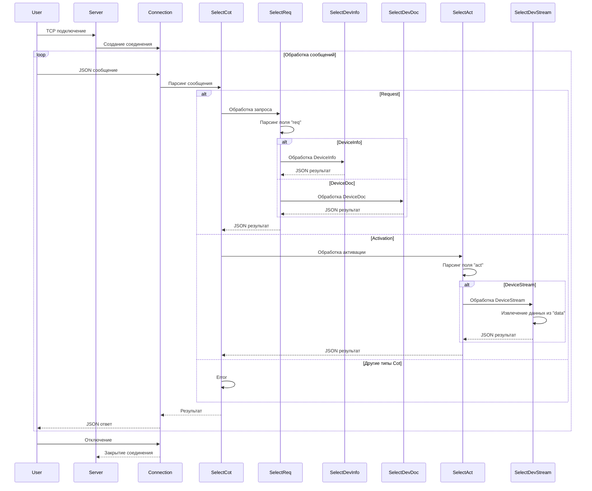
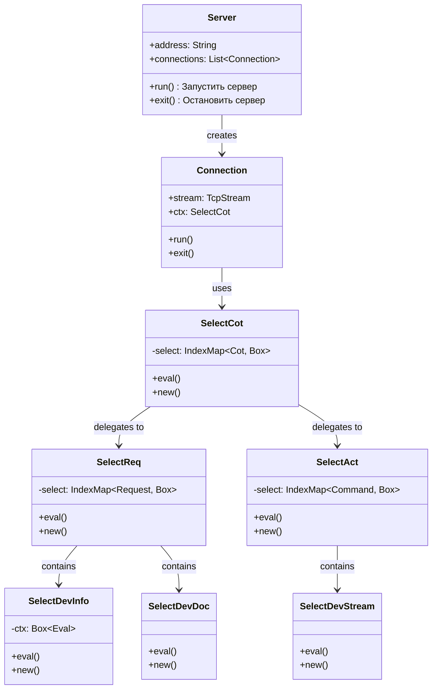

### Маршрутизация запросов в Connection, 

# IDM-Server - Описание функций
## Ключевые компоненты
### TCP-сервер (Server)
**Функционал**
- Открытие сокета на указанном порту из заданной конфигурации
- Прослушивание входящих подключений
- Обработка команд от клиента
- Создание для каждого подключения соединения `Connection`

**Жизненный цикл**
1. Создание объекта сервера
2. Запуск сервера:
    1. Открытие сетевого порта
    2. Ожидание подключнения клиента
    3. Создание `Connection` для подключённого клиента
    4. Передача в `Connection` настройки обработки:
        - команд
        - запросов
    5. Сохранение соединения в список
3. Ожидание завершения всех соединений
4. Остановка сервера

### Connection
**Функционал**
- Парсинг данные в структурированное сообщение `TcpMessage`
- Обработка сообщений
- Формирование и отправка ответа в формате JSON
- Управление временем жизни потока: завершение, выход, таймаут

**Жизненный цикл**
1. Создание соединения
2. Запуск соединения:
    1. Запуск двух потоков:
        - чтение
        - запись
    2. Чтение из сокета:
        1. Считывание данных
        2. Парсинг байтов в структурированное сообщение `TcpMessage`
        3. Сериализация результата в JSON
        4. Отправка результата
    3. Запись в сокет:
        1. Формерование ответа
        2. Отправка ответа в поток
3. Закрытие соединения, завершение потоков

## Функции
- конфигурация:
    - **Conf** - конфигурация сервера
- информация:
    - **DeviceInfo** - 
- domain:
    - **Eval** - 
    - **Sync** -
        - **Hub** - 
        - **LinkSend** - 
        - **Link** - 
- сервер:
    - **SelectAct** -
        - **Command** -
        - **DevConf** -
        - **DevStreamConf** -
        - **DevStream** -
    - **SelectReq** -
        - **Context** -
        - **Request** -
        - **SelectDevDoc** -
        - **SelectDevInfo** -
    - **ConnectionConf** -
    - **Connection** -
    - **Cot** -
    - **SelectCot** -
    - **ServerConf** -

## Поведенческая диаграмма

## Диаграмма классов

references

- [Requirenments](https://blog.bit.ai/software-requirements-document/)
- https://blog.bit.ai/software-design-document/
- https://www.geeksforgeeks.org/design-documentation-in-software-engineering/

