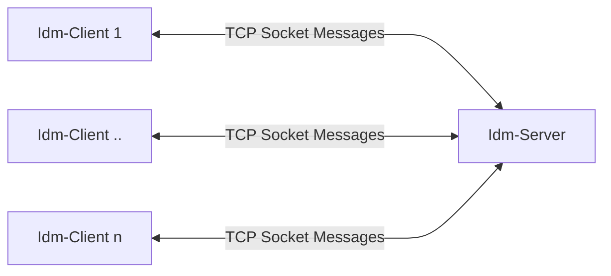
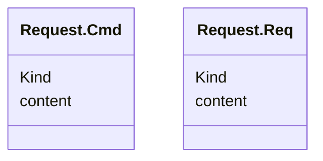
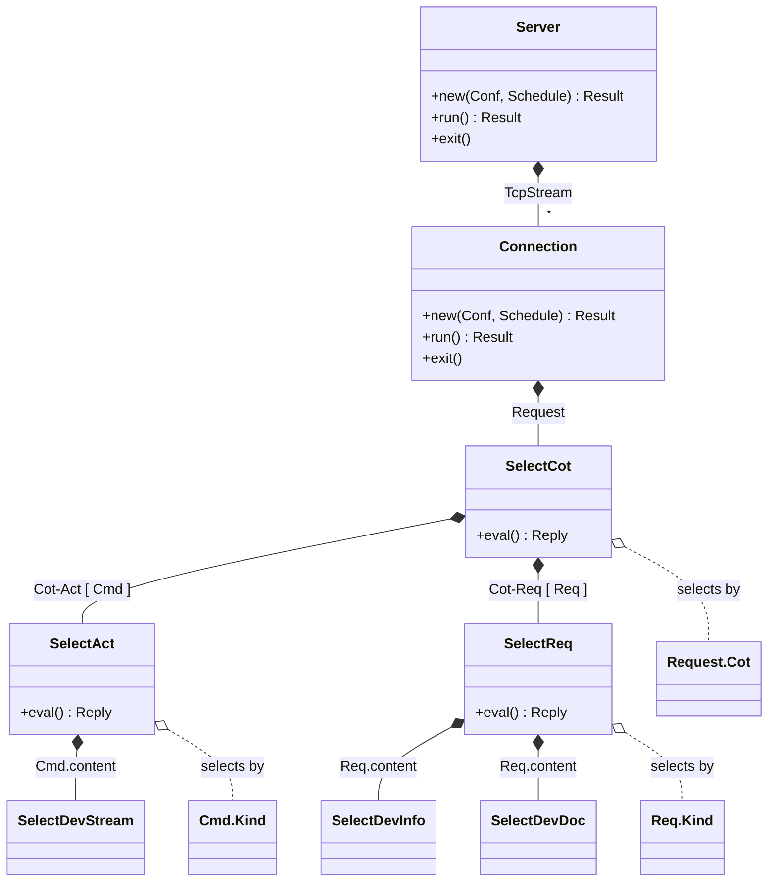

# Структуры


## Структура приложения



## Диаграмма классов

### Сообщения

- `Request` - Входящее сообщение, содержит причину передачи для перенаправления вложенного запроса соответствующему обработчику
- `Cot` - Причина передачи, служит классифицирует сообщения по направлении передачи и типу запроса

    Cot     | Направление      | Тип запроса                  | Ответ
    --------|------------------| ---                          | ---
    Inf     | Client -> Server | Информационное сообщение     | -
    Act     | Client -> Server | Комманда                     | Опионально
    ActCon  | Client -> Server | Положительный ответ          | -
    ActErr  | Client -> Server | Отрицательный ответ / ошибка | -
    Req     | Client -> Server | Запрос                       | Обязательно
    ReqCon  | Client -> Server | Ответ                        | -
    ReqErr  | Client -> Server | Ошибка                       | -


    **Диаграмма `Request` и `Cot`**

    ```mermaid
    classDiagram
        class Request {
            +Cot
            +Content
        }
        class Cot {
            +Inf
            +Act    // Request.Cmd
            +ActCon // Optional confirmation
            +ActErr
            +Req    // Request.Req
            +ReqCon // Required reply
            +ReqErr
        } 
    ```

- `Request.Cmd` - Если входящее сообщение, содержит причину Cot.Act, то в теле такого сообщения содержится команда
- `Request.Req` - Если входящее сообщение, содержит причину Cot.Req, то в теле такого сообщения содержится запрос



### Обработка сообщений в бэкенде приложениия



## Конфигурация приложения

Конфигурация в приложении представлена структурой `Conf`, загружается из `yaml` файла.

**Пример конфигурации `config.yaml`:**

```yaml 
server:
    # Server socket address "IP:Port"
    address: "127.0.0.1:8080"
    # Configuration to Connection spawned by the server
    connection:
        # timeout for waiting socket, ms
        timeout: 100
```

