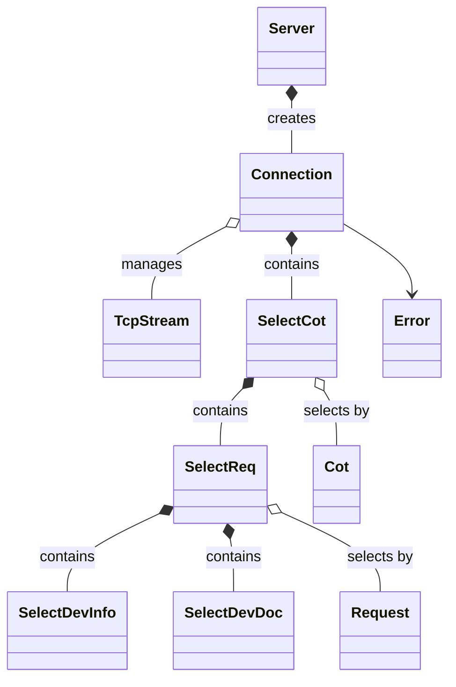

# Структуры

## Структура `Service`


```mermaid
classDiagram
Server *-- Connection : creates
Connection o-- TcpStream : manages
Connection *-- SelectCot : contains
Connection --> Error
SelectCot *-- SelectReq : contains
SelectCot o-- Cot : selects by
SelectReq *-- SelectDevInfo : contains
SelectReq *-- SelectDevDoc : contains
SelectReq o-- Request : selects by
```

## Структура `ServerConf`

```yaml
server:
  address: "127.0.0.1:8080"
  connection:
```

