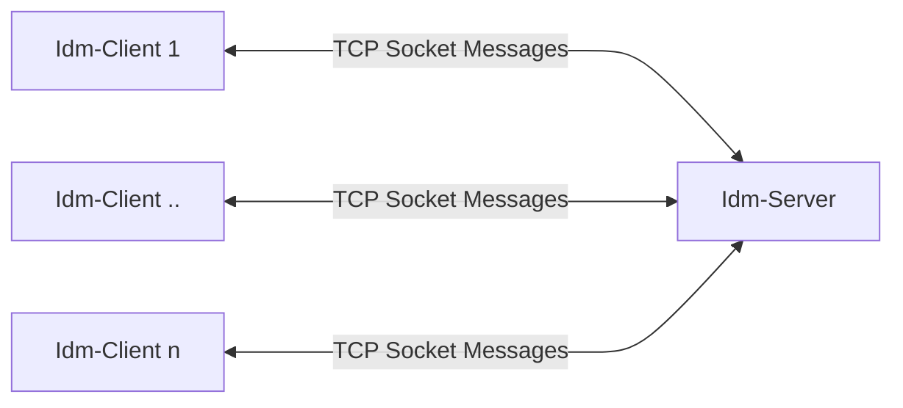
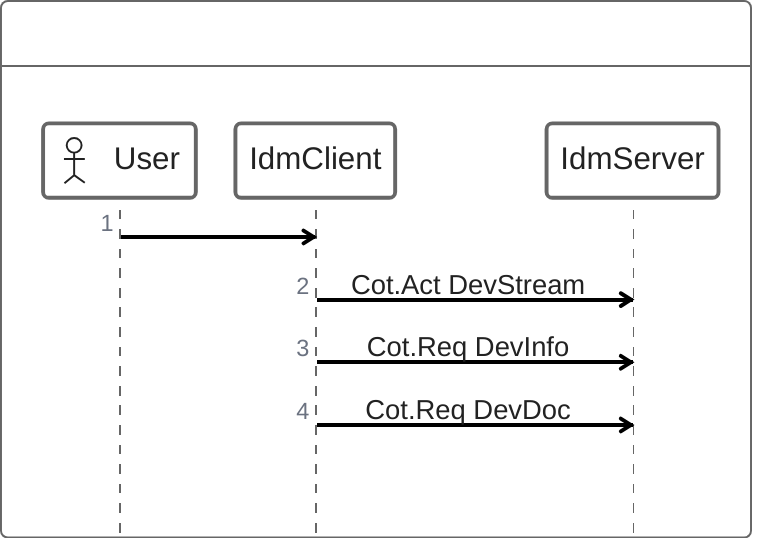
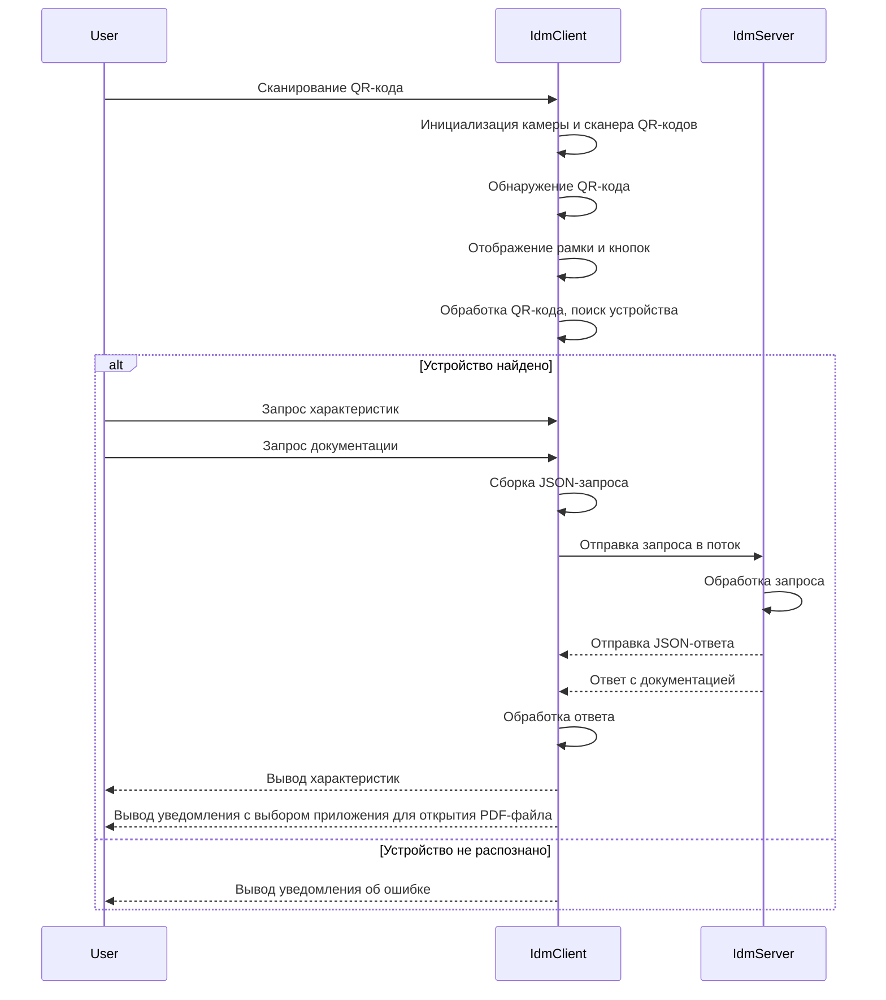
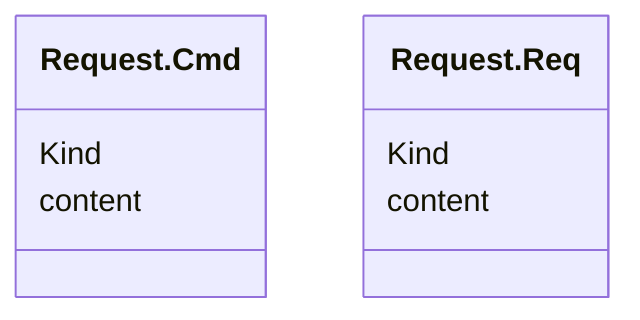
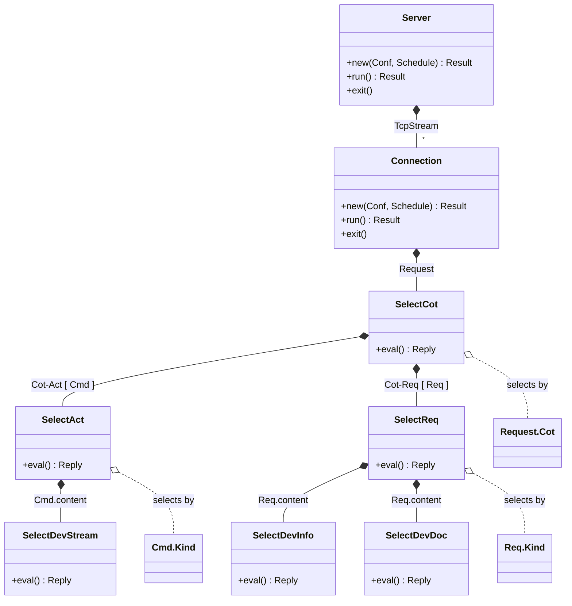

# Структуры
## Общее описание
### Информация о приложении
Приложение **Interactive Devices Monitoring** предназначено для получения актуальной информации по промышленному оборудованию. С помощью сканирования QR-кодов можно быстро получить как сводные характеристики интересующей машины, так и полную документацию в удобном формате.
Приложение предоставляет:
- **Надежность и актуальность**. Данные регулярно обновляются и хранятся в безопасной системе, обеспечивая пользователю только актуальную и проверенную информацию.
- **Быстрый доступ к данным**. Автоматизированное получение необходимой информации с помощью простого наведения камеры на QR-code. Вся необходимая информация доступна за мгновение, что ускоряет диагностику, ремонт и плановое обслуживание.
- **Универсальность и масштабируемость**. Приложение поддерживает широкий спектр оборудования и легко интегрируется в существующие процессы на производстве.
### Фронтенд
Интерфейс приложения представляет собой главный экран с доступом к камере и возможностью сканировать QR-code с интересующего оборудования.

Отображает:
- Общие характеристики
- Документацию в формате PDF
- Элементы управления
- Справку
### Бэкенд
Бэкенд — это внутренняя часть приложения, которая обрабатывает запросы от фронтенда. Когда пользователь сканирует QR-код, система находит подходящие данные в базе, подготавливает их и отправляет обратно на фронтенд для отображения.

### Подсистемы
#### Система автоматического тестирования
юнит тесты, интеграционные тесты
#### Система логирования

#### Дистрибуция
**Фронтенд:**
-   **Сборка:** APK-файл для Android `flutter build apk` или IPA-файл для iOS `flutter build ios --release`

**Бэкенд:**
-   **Сборка:** `cargo build --release`

#### Требования к устройству
**Фронтенд:**

| Параметр       | Минимальное требование   |
|:-----------:|:---------:|
| Операционная система      | Android 7.0/IOS 13     |
| Оперативная память      |4 Гб     |
| Камера      | Автофокус, разрешение 720р     |
| Память      | 100 Мб для кэширования     |

**Бэкенд:**

| Параметр       | Минимальное требование   |
|:-----------:|:---------:|
| Тип сервера      | Современный сервер x86_64     |
| Оперативная память      |2 Гб     |
| Процессор      | 2 ядра CPU    |
| Сетевое взаимодействие      | TCP     |

## Структура приложения



## Поведенческая диаграмма





## Диаграмма классов

### Сообщения

- `Request` - Входящее сообщение, содержит причину передачи для перенаправления вложенного запроса соответствующему обработчику
- `Cot` - Причина передачи, служит классифицирует сообщения по направлении передачи и типу запроса

    Cot     | Направление      | Тип запроса                  | Ответ
    --------|------------------| ---                          | ---
    Inf     | Client -> Server | Информационное сообщение     | -
    Act     | Client -> Server | Комманда                     | Опионально
    ActCon  | Client -> Server | Положительный ответ          | -
    ActErr  | Client -> Server | Отрицательный ответ / ошибка | -
    Req     | Client -> Server | Запрос                       | Обязательно
    ReqCon  | Client -> Server | Ответ                        | -
    ReqErr  | Client -> Server | Ошибка                       | -


    **Диаграмма `Request` и `Cot`**

    ```mermaid
    classDiagram
        class Request {
            +Cot
            +Content
        }
        class Cot {
            +Inf
            +Act    // Request.Cmd
            +ActCon // Optional confirmation
            +ActErr
            +Req    // Request.Req
            +ReqCon // Required reply
            +ReqErr
        } 
    ```

- `Request.Cmd` - Если входящее сообщение, содержит причину Cot.Act, то в теле такого сообщения содержится команда
- `Request.Req` - Если входящее сообщение, содержит причину Cot.Req, то в теле такого сообщения содержится запрос



### Обработка сообщений в бэкенде приложениия



## Конфигурация приложения

Конфигурация в приложении представлена структурой `Conf`, загружается из `yaml` файла.

**Пример конфигурации `config.yaml`:**

// TODO: Add missed conf entities
```yaml 
server:
    # Server socket address "IP:Port"
    address: "127.0.0.1:8080"
    # Configuration to Connection spawned by the server
    connection:
        # timeout for waiting socket, ms
        timeout: 100
    # Configuration for device streams
    dev_stream:
        # Map of devices with their fields
        devices:
            device_1:
                # base value
                value: 3.14,
                # acceptable deviation from the base value
                deviation: 0.2,
                # interval between updates, ms
                interval: 300,
            device_2:
                # base value
                value: 2.12,
                # acceptable deviation from the base value
                deviation: 0.15,
```